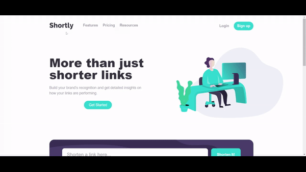

# Shorten Link Generator

Shorten Link Generator is a web application built with React and Vite, allowing users to shorten long URLs into more manageable and shareable links using the shrtco.de API. The project is part of the Frontend Mentor platform challenge, and it is fully responsive, ensuring a seamless user experience across various devices.

## Features

- Shorten long URLs into concise and shareable links.
- Copy the shortened link to the clipboard with a single click.
- Store the list of shortened links in the browser's local storage.
- Fully responsive design to accommodate different screen sizes.

## Live Demo

- ### Check out the live demo [here](https://shortly-mohamed-galdi.vercel.app/).



## Installation

1. Clone the repository:

   ```bash
   git clone https://github.com/Mohamed-Galdi/FEM-Shortly
   ```
2. Change into the project directory:
    ```bash
   cd FEM-Shortly
   ```
3. Install dependencies:
    ```bash
   npm install
   ```
4. Run the development server:
    ```bash
    npm run dev
   ```
Open your browser and navigate to http://localhost:5173 to view the app.


## Technologies Used

- React
- Vite
- Tailwind CSS
- Axios

## API
The app utilizes the shrtco.de API to generate shortened links. The API documentation can be found [here](https://shrtco.de/).

## Acknowledgements

This project was created as part of the Frontend Mentor platform challenge. Special thanks to Frontend Mentor for providing the design and specifications for this project.

## Contact

- Email: contact.galdi@gmail.com
- LinkedIn: https://www.linkedin.com/in/mohamed-galdi/
- Portfolio: https://galdi.dev